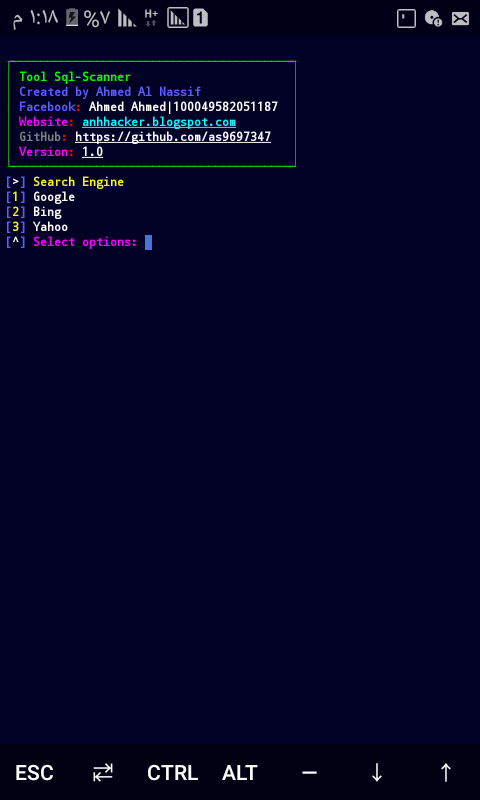
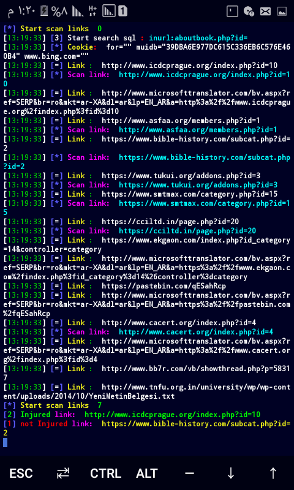

# Sql-Scan
a tool is scanning websites for search about websites Injured in sql
# Screenshot



# Install
```
pkg update -y
pkg install git python2 -y
pip2 install base64
git clone https://github/as9697347/Sql-Scan.git
cd Sql-Scan
python2 sql-scan.py
```
# Search Engine:
# Goole
# Bing
# Yahoo

# Usage:
I am not responsible for misuse this tool for security purposes

# Facebook
<a href='https://facebook.com/100049582051187'>click here</a>


# Website
<a href='https://anhhacker.blogspot.com/2021/04/sql-scan.html?m=1'>click here</a>


# Donation
<a href='mailto:ahmed.nassif.hacker@gmail.com'>click here</a>
